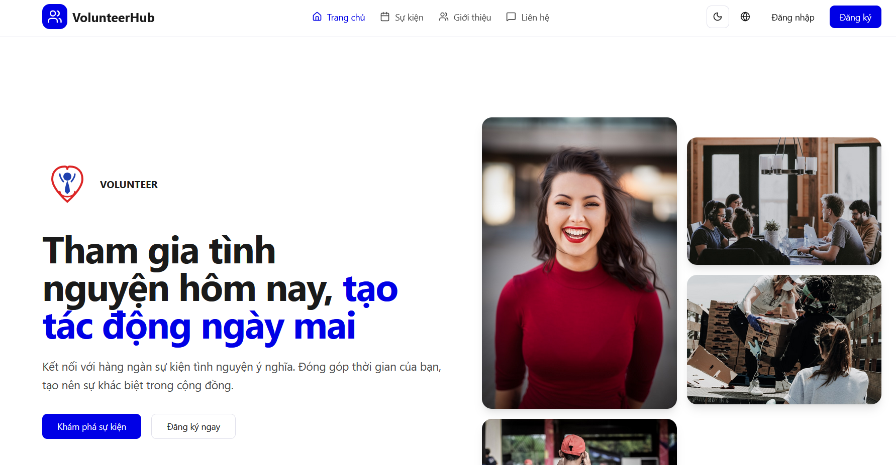
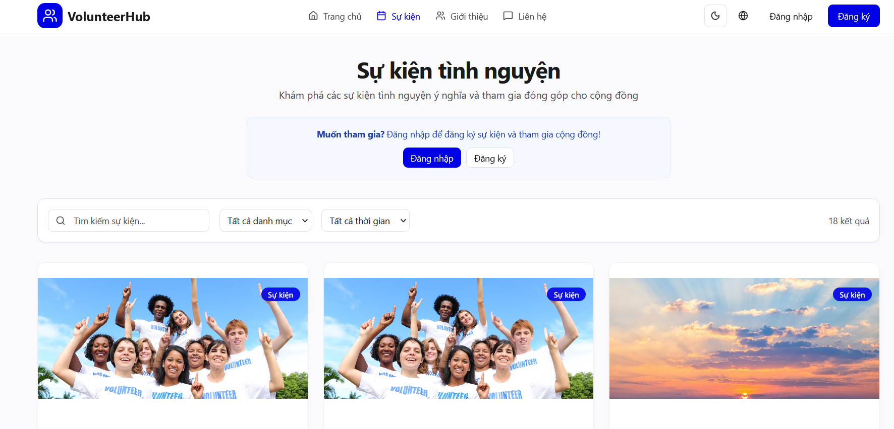
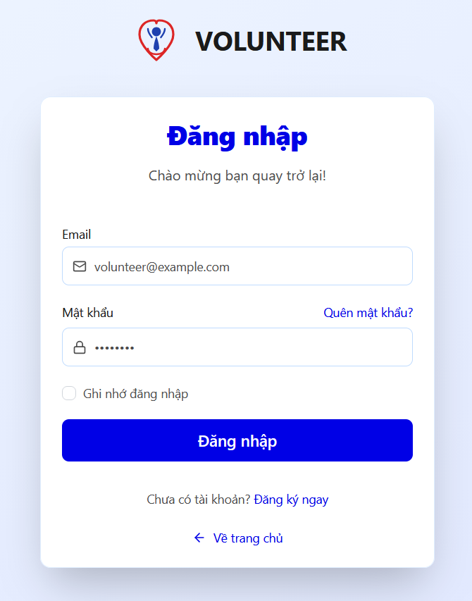
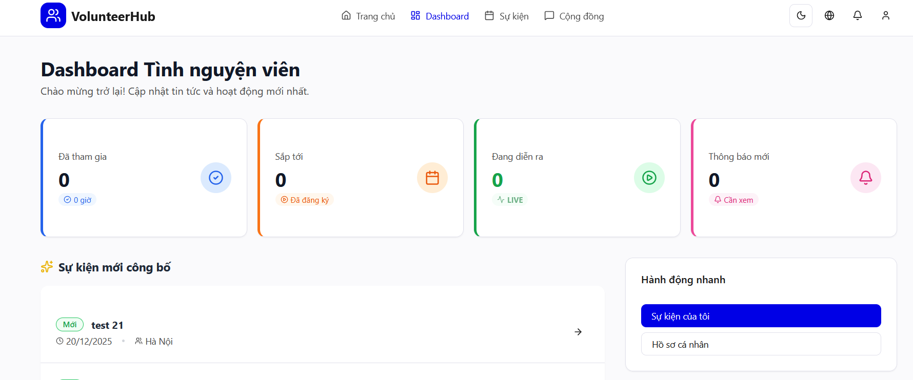
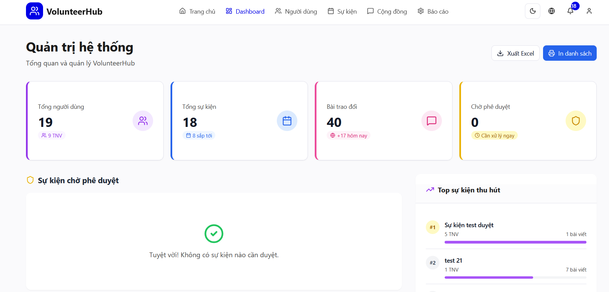

# VolunteerHub – Hệ thống quản lý và tham gia sự kiện tình nguyện

## 1. Giới thiệu

**VolunteerHub** là một ứng dụng web được xây dựng nhằm hỗ trợ việc **tổ chức, quản lý và tham gia các sự kiện tình nguyện**.

Dự án hướng tới:

- Mô phỏng quy trình quản lý sự kiện tình nguyện ngoài thực tế
- Áp dụng kiến thức lập trình web full-stack
- Xây dựng hệ thống phân quyền và quản lý dữ liệu hiệu quả

## 2. Công nghệ sử dụng

### Frontend

- ReactJS
- Axios
- React Hooks
- HTML, CSS
- Web Push API (thông báo)

### Backend

- Spring Boot
- RESTful API
- JWT Authentication
- Hibernate Validator (validate dữ liệu)
- JPA / Hibernate

### Cơ sở dữ liệu

- MongoDB

## 3. Kiến trúc hệ thống

- Kiến trúc **Client-Server**
- Giao tiếp thông qua **RESTful API**
- Xác thực và phân quyền bằng **JWT**
- Backend chịu trách nhiệm:
  - Xử lý nghiệp vụ
  - Validate dữ liệu
  - Phân quyền truy cập
- Frontend chịu trách nhiệm:
  - Giao diện người dùng
  - Quản lý trạng thái
  - Tối ưu số lượng request

## 4. Giao diện người dùng

Giao diện người dùng được thiết kế thân thiện, dễ sử dụng.

## 5. Ghi chú

Dự án được thực hiện cho mục đích học tập

Chưa triển khai đầy đủ các cơ chế bảo mật cho môi trường production

Vui lòng không sử dụng mã nguồn này cho các mục đích thương mại

## 6. Thông tin nhóm thực hiện

- Sinh viên thực hiện:
  - Trương Mạnh Khiêm
  - Nguyễn Hữu Hiếu
  - Nguyễn Thị Huyền
- Môn học: Lập trình ứng dụng Web
- Giảng viên: Lê Đình Thanh
